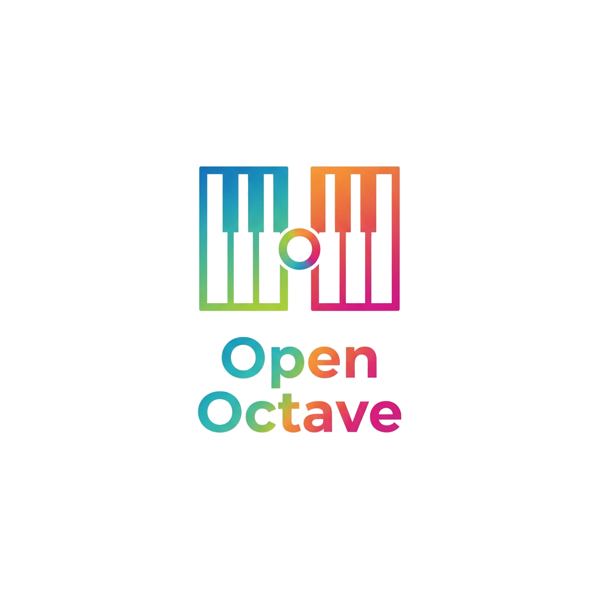

  

# Open Octave

## Project Overview
**Open Octave** is a modular, robotically enhanced educational piano keyboard system designed to make early-stage piano education more accessible and engaging in the classroom. The physical system consists of connectable keyboard modules controlled by our firmware. The system also provides a teacher-facing frontend which allows them to control the keyboard modules remotely, and a proxy server for software-firmware communication.

**Open Octave's** robotic features, such as light-up keys and a self-playing mechanism, enable unique learning modes aimed at aiding the retention of melodic piano sequences for young learners. Its modularity also encourages less advanced learners to become familiar with the mechanics of piano playing on smaller keyboard modules without being overwhelmed by a full 88-key smart keyboard with all bells and whistles.

**Open Octave** began as an undergraduate robotics project at The University of Edinburgh, and has now been made open course for further development.